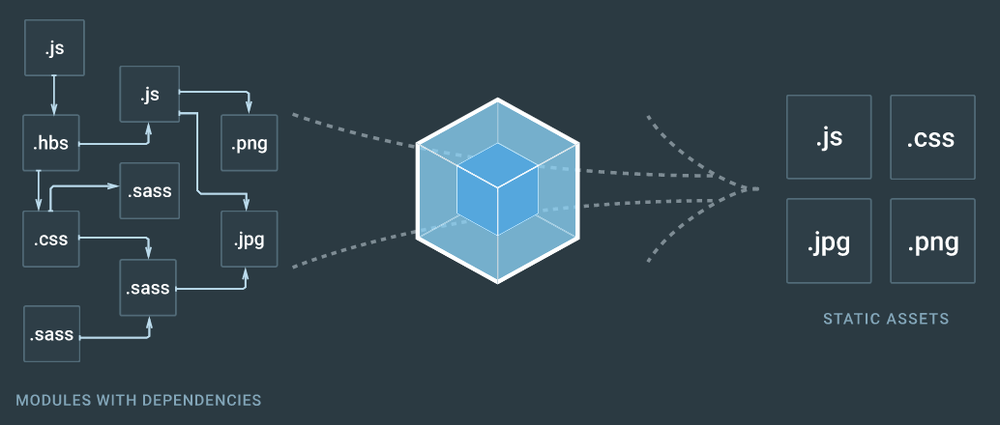

# Introduction04
## webpackについて

### webpackとは
webpackとは、「モジュールバンドラー」と言われ、文字通りモジュールをひとまとめにするバンドルツールです。<br>
CSS・javascript・画像などのあらゆるwebコンテンツを「モジュール」という単位で扱い、１つのファイルに最適な形で変換してまとめてくれます。

１つのjsファイルに長い処理を書くと可読性が悪くなったり、バグが生まれやすくなったり、開発スピードが遅くなってしまいます。<br>
これを解決するためにコンポーネント（モジュール）ごとにjsファイルを分割して作成し、それをバンドル方法がよくとられます。

また、webpackではjsだけでなく、CSS・画像・webフォント・動画などあらゆるアセットをモジュールとして扱って１つのバンドルとして出力してくれます。



### webpackを使ってみよう
webpackを使用するためには、まずnpmでwebpackパッケージをインストールします。<br>
その後webpackパッケージをnode.jsの上で動かします。

今回作業する上での最終的なディレクトリ構成は下記になります。

```
ProjectRootFolder
|- package.json
|- node_modules/
|- webpack.config.js
|- src/
    |- index.js
    |- hello.js
    |- say.js

```

#### 1.package.jsonファイルの作成
webpackを使用するためには、npmでインストールする必要があります。
そのためには、開発ディレクトリのルート直下で、 `npm init` コマンドを叩きpackage.jsonを作成します。（すでに誰かが環境構築している場合は必要ありません）

 ```bash
$ npm init -y
```

そうすると、ルート直下に `package.json` ファイルが作成されます。

#### 2.webpackのインストール
次に、npmコマンドを使用してwebpackをインストールします。

```bash
$ npm install --save-dev webpack
```

コマンド入力後、 ルート直下に`node_modules`フォルダが作成され、 `package.json`にwebpackのパッケージリストが登録されます。

これで、webpackを使用する準備が整いました。

#### 3.モジュールを作成する
webpackを使ってバンドルするためのモジュールを作成します。

エントリポイントと呼ばれるjsファイル（index.js）を１つ作成します。<br>
その後、index.jsで取り込むための他のファイル（hello.js, bye.js）を作成します。

また、webpackでは読み込みと吐き出しを行うのですが、基本的には読み出しをするところを `srcフォルダ`とし、吐き出す場所を`buildフォルダ`にします。


```js
// /src/index.js

var hello = require('./hello');
hello.say();

var bye = require('./bye');
bye.say();
```

```js
// /src/hello.js

module.exports = {
  say: function() {
    alert('hello!');
  }
};

```

```js
// /src/bye.js

module.exports = {
  say: function() {
    alert('bye!');
  }
}

```

#### 4.webpackの設定を記述する
webpackを使用するにはwebpackをつかってどういう風にバンドルするのか・他に何をするのかといった設定ファイルを書かなくてはなりません。<br>
ここの設定が結構重要だったりします。

開発ディレクトリのルート直下に`webpack.config.js`を作成します。

[webpackの設定ファイルについてはこちら（公式ドキュメント - 英語）](https://webpack.js.org/configuration/)

```js
// webpack.config.js

var path = require('path');
var srcDir = path.resolve(__dirname, '/src');
var buildDir = path.resolve(__dirname, '/build');

// ここでmodule.exportsをしているのはwebpackの決まりだと思ってください
module.exports = {
  
  // どのjsファイルをエントリポイント（最初にwebpackで読み込むかを指定します）
  entry: srcDir + '/index.js',
  
  // どこに吐き出すか、バンドルしたファイル名をどうするかの設定を記述します
  output: {
    filename: 'bundle.js',
    path: buildDir
  },
}

```

#### 5.webpackの実行設定をする
webpackの設定を記述したら、webpackを実行してみます。

実行するためにはターミナルから下記コマンドを入力すれば実行ができます。

しかし、毎回上記のようなコマンドを打ち込んで実行するのはとても面倒なので、`npm-scripts`を用いてコマンドをエイリアス化（置き換える）します。<br>
`package.json`を開き `scripts`と書かれた連想配列にコマンドを記述します。

```bash
// ターミナルから実行するコマンド
$ ./node_modules/.bin/webpack
```

```json
// package.jsonで npm-scriptsを登録

{
  //...省略
  
  "scripts": {
    "build": "webpack"  // この行を追加
  }
  
  
  //...省略
}

```

※ `npm-scripts`で記述した場合、 `./node_modules/.bin/`の部分は省略して記述することができます。

#### 6.webpackを実行・確認する

全ての設定が終わったのでwebpackを実行しましょう！

npm-scriptsを実行させるためには `npm run xxxx` と入力します。<br>
今回の場合、webpackコマンドを実行させるためには `build` を指定する必要があるので、下記コマンドを入力しましょう。

```bash
$ npm run build
```

上記コマンドを入力すると、buildフォルダが生成されその中にbundle.jsが生成されてます。<br>
bundle.jsの中身をみてみるとwebpackが追記した記述とindex.jsとhello.jsとbye.jsの記述が記載されていることがわかります。


<span align="left">[<< Introduction 03: ECMAScript2015について](introduction03.md)</span>
<span align="right">[Introduction 05: SPAとはなにか >>](introduction05.md)</span>
